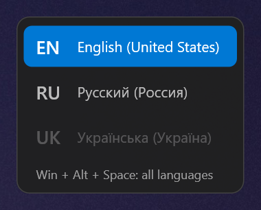
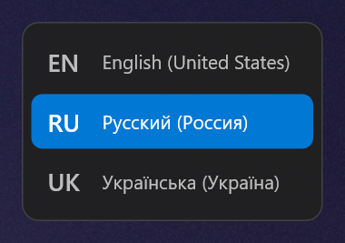

# WinSpaceSwitcher

A tiny, fast replacement for the Windows **Win+Space** keyboard layout switcher.

- Switches the layout the moment you press **Win+Space** — no system flyout, no animation to wait for.
- **Required and optional layouts**: Win+Space cycles only through the layouts you use daily; **Win+Alt+Space** reaches all of them.
- A clean layout panel on every monitor (or just one), at the screen edge, in the center, next to the cursor or following it — resizable, with light/dark themes and the Windows accent color.
- The current layout (EN, RU, …) right in the tray icon.
- Works in **elevated windows** (Task Manager, admin terminals) when started with Windows.
- One portable ~650 KB executable, ~6 MB of memory, no installer, no runtime to install.

<p align="center">
  
  
</p>

## Requirements

Windows 10 version 1703 or later, or Windows 11 (x64).

## Installation

1. Download `WinSpaceSwitcher.exe` (or [build it](#building)).
2. Put it in a permanent folder, for example `%LOCALAPPDATA%\Programs\WinSpaceSwitcher\`.
   Autostart remembers this path, so don't run it from *Downloads*.
3. Run it. A blue keyboard icon appears in the tray (Windows may hide it under the **^** arrow — drag it onto the taskbar to keep it visible).
4. Open the tray menu and enable **Start with Windows**.

> **SmartScreen / antivirus.** The executable is not code-signed, so on first launch Windows may show
> *"Windows protected your PC"* — choose **More info → Run anyway**. Because the app uses a global keyboard
> hook and injects keystrokes, some antivirus heuristics may flag it. It makes no network connections and
> stores nothing but its settings (unless you explicitly run it with `--log`); if in doubt, build it yourself
> from source.

## Usage

| Keys | Action |
|---|---|
| **Win+Space** | Next *required* layout |
| **Win+Alt+Space** | Next layout, including *optional* ones |
| add **Shift** | Same, backwards |

Keep holding Win and press Space repeatedly to step through layouts; the panel shows where you are and
disappears when Win is released. Win+Ctrl+Space is left to Windows.

## Tray menu

Left or right click the tray icon.

```
Win+Space cycles through:
✓ EN   English (United States)
✓ RU   Русский (Россия)
  UK   Українська (Україна)          ← unchecked = optional
Unchecked: Win+Alt+Space only
─────────────
Language panel      ▸  Show panel
                        Position  ▸  Right edge · Screen center · Near cursor · Follow cursor
                        Size      ▸  75 · 90 · 100 · 125 · 150 · 200 %
                        Delay     ▸  None · 150 · 300 · 500 ms
                        Fade in   ▸  Off · 100 · 150 · 250 · 400 ms
                        Fade out  ▸  Off · 100 · 150 · 250 · 400 ms
                        Show on all monitors
Appearance          ▸  System theme · Dark · Light
                        Windows accent color
                        Language in tray icon
Start with Windows
Restart as administrator            ← only shown when not elevated
─────────────
Exit
```

- **Layouts** — at least one layout always stays required.
- **Position** — *Near cursor* places the panel next to the pointer on each switch; *Follow cursor* keeps it
  there while it is visible. Both use only the pointer's monitor.
- **Delay** — show the panel only if Win is still held after this time, so quick switches stay silent.
- **Size** — applied on top of each monitor's own scaling, and rendered at that size (not stretched).
- **Fade in / Fade out** — pressing Win+Space again while the panel fades out brings it back smoothly.
- **Appearance** — *System theme* follows the Windows light/dark app setting and updates when it changes,
  as do the accent color and the tray menu. Text on the accent is black or white, whichever is readable.
- **Language in tray icon** — updated instantly on Win+Space; changes made elsewhere (mouse, other hotkeys,
  switching windows) are picked up within a quarter of a second.
- **Start with Windows** — see [Elevated windows](#elevated-windows-and-autostart).

Checkboxes keep the menu open, so several options can be changed in a row.

## Elevated windows and autostart

Windows does not let a normal process see keystrokes sent to, or change the layout of, a window running as
administrator. To work everywhere, the switcher itself must run elevated.

**Start with Windows** registers a Task Scheduler task that starts the app at logon with the highest
privileges — elevated, but without a UAC prompt at every logon. Registering such a task needs administrator
rights once: you get a single UAC prompt, after which an elevated copy creates the task and takes over from
the running one, so it works in elevated windows immediately.

The task runs at normal priority with no time limit (Task Scheduler defaults would lower the priority and stop
it after 72 hours). If the app was started manually without elevation, **Restart as administrator** does the
same takeover without touching autostart.

## Reliability

- **Hook re-arming.** Windows silently removes a low-level keyboard hook that times out — typically around
  sleep, heavy load or the lock screen — and there is no way to detect it. The hook is therefore re-installed
  after resume from sleep, on session unlock and reconnect (including Remote Desktop), and every 10 minutes as a
  safety net. The new hook is installed before the old one is removed, so no key is missed or seen twice.
- **Crash recovery.** Every launch is a small watchdog process that runs the app as a child and restarts it
  after a crash (at most 3 times in 5 minutes). Exiting from the tray, or ending the process from Task Manager,
  is respected and not restarted. This is why Task Manager shows two `win-space-switcher.exe` processes.

## Settings

Stored in `%APPDATA%\WinSpaceSwitcher\settings.json` and saved on every change:

```json
{
  "OptionalLayouts": ["FFFFFFFFF0A80422"],
  "ShowOverlay": true,
  "ShowOnAllMonitors": true,
  "PanelPosition": "RightEdge",
  "OverlayDelayMs": 0,
  "FadeInMs": 100,
  "FadeOutMs": 150,
  "PanelScalePercent": 100,
  "Theme": "System",
  "UseAccentColor": true,
  "TrayShowsLanguage": true
}
```

| Key | Values | Default |
|---|---|---|
| `OptionalLayouts` | Keyboard layout handles (hex) skipped by Win+Space | `[]` |
| `ShowOverlay` | Show the panel at all | `true` |
| `ShowOnAllMonitors` | All monitors or only the primary one | `true` |
| `PanelPosition` | `RightEdge`, `ScreenCenter`, `NearCursor`, `FollowCursor` | `RightEdge` |
| `OverlayDelayMs` | Delay before the panel appears | `0` |
| `FadeInMs`, `FadeOutMs` | Fade durations, `0` disables | `100`, `150` |
| `PanelScalePercent` | Panel size on top of monitor scaling | `100` |
| `Theme` | `System`, `Dark`, `Light` | `System` |
| `UseAccentColor` | Windows accent color instead of the built-in blue | `true` |
| `TrayShowsLanguage` | Current layout in the tray icon instead of a keyboard | `true` |

Missing keys fall back to defaults; a broken file is ignored.

## Troubleshooting

Run with `--log` to write every key event and switch to `hotkeys.log` in the working directory.
The log contains the keys you press, so delete it when done:

```bash
WinSpaceSwitcher.exe --log
```

Only one instance runs at a time; starting it again while it is running does nothing.

## Known limitations

- The executable is unsigned (see SmartScreen note above).

## How it works

- **Keyboard hook** — a global `WH_KEYBOARD_LL` hook on its own thread with its own message loop, so a busy
  UI can never delay it past `LowLevelHooksTimeout` (after which Windows silently removes hooks). The hook
  callback only decides whether to swallow a key; all work happens on a separate worker thread.
- **No Start menu** — Win itself is never swallowed, only Space. Since the shell would then see Win pressed
  "alone" and open Start on release, an unassigned key (`vkE8`) is injected right before the release reaches
  the system — the same technique as AutoHotkey's `#MenuMaskKey`.
- **Phantom Ctrl** — when switching to or from a layout with AltGr, Windows emits a Ctrl release with no
  matching press. While Win is held this opens Start immediately, so such releases are masked as well
  (the same fix as AutoHotkey 1.1.27.01). The Alt of Win+Alt+Space is masked the same way to keep window
  menus from activating.
- **Switching** — `WM_INPUTLANGCHANGEREQUEST` is posted to the focused window. Within one Win hold the next
  layout is computed from the previous choice, not re-read from the window, because windows apply the
  request asynchronously.
- **Panel** — layered, click-through, never-activated windows drawn with Direct2D/DirectWrite into a
  premultiplied DIB and presented with `UpdateLayeredWindow`. Rendering uses Direct2D's software rasterizer:
  for a few lines of text this avoids creating a GPU device and keeps memory around 6 MB. Fades and cursor
  following change only the window alpha and position, never repainting.
- **Per-monitor DPI** — the panel is laid out in device-independent pixels and rendered at each monitor's DPI.

## Building

Requires the Rust toolchain with the MSVC target (`x86_64-pc-windows-msvc`).

```bash
cargo build --release
```

The executable is `target\release\win-space-switcher.exe`. The C runtime is linked statically
(`.cargo/config.toml`), so it runs without the Visual C++ Redistributable.

```bash
cargo test
```

### Project layout

```
src/
  main.rs              entry point
  app/                 composition root and window procedure (mod.rs), UI state and timers (ui_state.rs),
                       tray menu and its commands (menu.rs)
  input/               low-level keyboard hook, key state and injection
  switching/           hotkey interceptor (masking logic), layout cycling, worker thread
  layouts.rs           installed layouts, active window's layout, language names
  settings.rs          settings model and JSON store
  autostart.rs         Task Scheduler autostart
  watchdog.rs          crash-restarting supervisor process
  elevation.rs         elevation check and elevated relaunch
  diagnostics.rs       --log file log (decorators)
  native.rs            small Win32 helpers
  ui/                  panel (overlay, placement, fade, renderer), palette and system theme (theme),
                       tray icon and menu (tray), menu theming (dark_mode)
```
